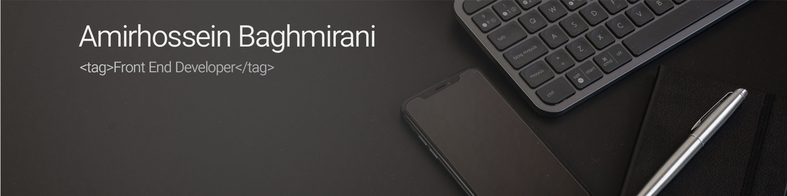

<h2>Hi There! I'm AmirHossein Baghmirani 🖐</h2>

Front end programmer 🖥 student of network and software 💻 👨 and I love binary world ✌️

<h3>👨‍💻 &nbsp; About Me</h3>

- 🎓 &nbsp; Student
- 🎓 &nbsp; I Love Music
- 🌱 &nbsp; Learning React
- ✍️ &nbsp; Coding And Drinking Coffee Are My Hobby :))

<h2>🔧 &nbsp; Tech Stack</h2>

- 🌐 &nbsp;
  
  
  
  
  
  
  
  
  
- ⚙️ &nbsp;
  
  
  
  

  
- 🔧 &nbsp;
  
  
  
- 🖥 &nbsp;
  

 

<h2>📞 &nbsp; Connect Me </h2>

  
  
    

